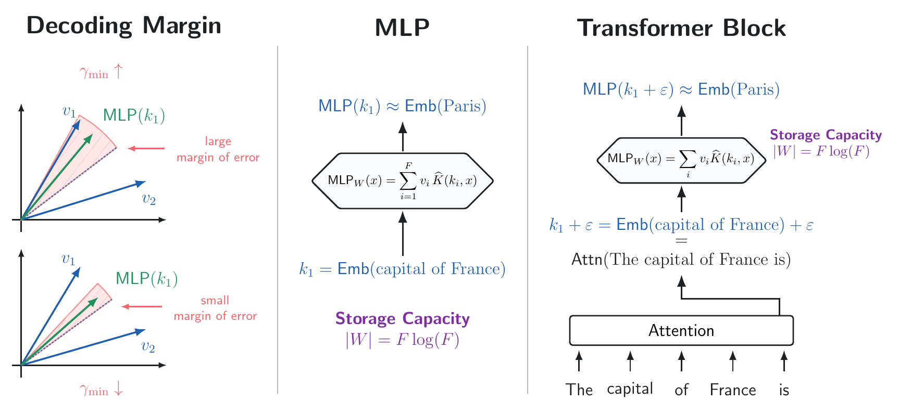

# MLPs Are Hebbians

Code for *MLPs are Hebbians: Constructing Efficient Fact-Storing MLPs for
Transformers*. **Accepted to COLM 2026.**

[](https://arxiv.org/abs/2607.10034)



This repository contains the code to replicate the experiments from the paper,
including Hebbian MLP constructions, Transformer integration, Qwen3 activation
experiments, and fact-editing experiments.

## Install

Python 3.10 or 3.11 is recommended.

```bash
git clone https://github.com/HazyResearch/hebbian-mlps.git
cd hebbian-mlps
python3.11 -m venv .venv
source .venv/bin/activate
python -m pip install --upgrade pip
python -m pip install -e .
```

For the Qwen3 experiments, install the optional Hugging Face dependencies:

```bash
python -m pip install -e '.[llm]'
```

## Reproduce Experiments

Paper experiments use the Python command in `scripts/paper/run.py`. List the
available targets with:

```bash
python scripts/paper/run.py --list
```

Run an experiment and generate its plot, or replot an existing result, with:

```bash
python scripts/paper/run.py fig_rf_margin_m --mode run-and-plot
python scripts/paper/run.py fig_rf_margin_m --mode plot-only
```

The [paper experiment guide](PAPER_EXPERIMENT_MAP.md) groups the results by
experiment type and links their implementations. To replicate the Qwen3
experiments, see the following
[instructions](src/hebbian/expts/llm_embeddings/README.md).

## License

Released under the [Apache License 2.0](LICENSE).
